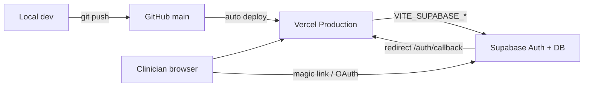

# Stack checklist — GitHub → Vercel → Supabase

Audit date: **2026-06-21**. Production URL: **https://psychdispo.com**

This doc tracks what is wired for the **GitHub → Vercel → Supabase** production stack and what still needs dashboard or code work.

---

## Architecture (target)



---

## ✅ Done

### GitHub

| Item | Notes |
|------|-------|
| Remote repo | `https://github.com/kapespalms/psychdispo` (public, default branch `main`) |
| App source in repo | TanStack Start + Vite app under repo root |
| README deploy note | Documents push-to-`main` → Vercel |

### Vercel

| Item | Notes |
|------|-------|
| Production live | `psychdispo.com` returns **200**, `server: Vercel` |
| Build config | `vite.config.ts` → `nitro: { preset: "vercel" }`; `npm run build` → `vite build` |
| Production Supabase env | `VITE_SUPABASE_URL` + `VITE_SUPABASE_ANON_KEY` set (see [PHASE4_SETUP.md](./PHASE4_SETUP.md)); sign-in page shows magic link + Google buttons |
| Custom domain | `psychdispo.com` serving production |
| Local project link | `.vercel/project.json` → project `psychdispo-caringcompass` (gitignored) |
| SSR / routes | `/sign-in`, `/auth/callback`, `/dispo`, marketing pages deployed |

### Supabase

| Item | Notes |
|------|-------|
| Project ref | `kqvpptcmnaeqvmlxlvba` |
| Project URL | `https://kqvpptcmnaeqvmlxlvba.supabase.co` |
| Migration applied | `phase4_templates` — `plan_templates`, `favorite_resources` with RLS |
| Client code | `src/lib/supabase.ts`, `src/lib/auth.tsx`, `src/lib/cloud-library.ts` |
| Auth callback route | `src/routes/auth/callback.tsx` handles session + redirect to `/dispo` |
| Edge functions | None (not required for current scope) |
| `.env.example` | Documents `VITE_SUPABASE_URL`, `VITE_SUPABASE_ANON_KEY` |

### App integration

| Item | Notes |
|------|-------|
| Guest mode | Full workflow without Supabase |
| Magic link + Google (code) | `signInWithOtp` / `signInWithOAuth` with `redirectTo: …/auth/callback` |
| PHI boundary | Templates strip patient fields before cloud save (see PHASE4_SETUP) |
| Partial SEO on prod | Homepage has canonical + meta description; `/sign-in` has `noindex` |

---

## ⚠️ Partial / manual step required

### Supabase Dashboard (blocks auth until done)

| Item | Action | Dashboard |
|------|--------|-----------|
| **Site URL** | Set to `https://psychdispo.com` | [Auth → URL Configuration](https://supabase.com/dashboard/project/kqvpptcmnaeqvmlxlvba/auth/url-configuration) |
| **Redirect URLs** | Add `http://localhost:5173/auth/callback` and `https://psychdispo.com/auth/callback` | Same page |
| **Preview deploys** | Add `https://*.vercel.app/auth/callback` (or each preview URL) if you test auth on PR previews | Same page |
| **Google OAuth** (optional) | Enable provider + Google Cloud OAuth client; redirect URI `https://kqvpptcmnaeqvmlxlvba.supabase.co/auth/v1/callback` | [Auth → Providers → Google](https://supabase.com/dashboard/project/kqvpptcmnaeqvmlxlvba/auth/providers) |

> Supabase MCP cannot set auth URL config; this must be done in the dashboard (or Management API).

### Vercel Dashboard

| Item | Action | Dashboard |
|------|--------|-----------|
| **Preview / Development env** | Copy `VITE_SUPABASE_*` to Preview (and Development if used) so PR previews get Supabase | [Project → Settings → Environment Variables](https://vercel.com/) → `psychdispo-caringcompass` |
| **Git integration** | Confirm connected repo is **`kapespalms/psychdispo`** (local `origin`). PHASE4_SETUP mentions `fiscmak/psychdispo-caringcompass` — reconcile if deploys are not triggering on push | [Project → Settings → Git](https://vercel.com/) |
| **Production redeploy** | After env or auth URL changes, redeploy production | Deployments → Redeploy |

### SEO (code exists, not fully shipped)

| Item | Status |
|------|--------|
| `public/robots.txt` | **Local only** — production returns **404** (not committed) |
| `public/sitemap.xml` | **Local only** — production returns **404** (not committed) |
| `src/lib/seo.ts` + route `head()` updates | Modified locally; **not on `origin/main`** |
| Google Search Console | Manual — see [SEO_INDEXING.md](./SEO_INDEXING.md) |

**Fix:** commit + push `public/robots.txt`, `public/sitemap.xml`, SEO route changes, then verify:

```bash
curl -sI https://psychdispo.com/robots.txt
curl -sI https://psychdispo.com/sitemap.xml
```

### Other partial items

| Item | Notes |
|------|-------|
| **GitHub Pages** | Enabled at `https://kapespalms.github.io/psychdispo/` (legacy, branch `main`, path `/`) — redundant with Vercel; consider disabling to avoid confusion |
| **Supabase CLI link** | Only `supabase/migrations/…sql` in repo; no `config.toml`, no `supabase link` in docs |
| **Shared Supabase project** | Same project hosts FISCMAK tables (`profiles`, `evidence_*`, etc.) plus PsychDispo `plan_templates`. RLS isolates rows; consider a dedicated project later for cleaner blast radius |
| **Leaked password protection** | Disabled (Supabase advisor WARN) — low priority; app uses magic link/OAuth, not passwords |

---

## ❌ Missing

### GitHub

| Item | Recommendation |
|------|----------------|
| **Branch protection** | Not enabled on `main` — add required status checks before direct pushes |
| **CI workflows** | No `.github/workflows/` — no lint/build on PR or push |
| **Deploy hooks** | No repo webhooks visible via API (Vercel may use GitHub App instead — verify in Vercel) |

Suggested minimum CI: `npm ci` → `npm run lint` → `npm run build` on pull requests.

### Vercel / ops

| Item | Recommendation |
|------|----------------|
| **`vercel.json`** | Not present (Nitro preset may be sufficient); add only if you need redirects, headers, or cron |
| **Staging environment** | No separate Vercel project or `staging.psychdispo.com` |
| **Analytics** | No Vercel Analytics, PostHog, Plausible, or GA in codebase |
| **Error tracking** | No Sentry / similar |
| **Uptime monitoring** | No Better Stack, Checkly, etc. |

### Supabase

| Item | Recommendation |
|------|----------------|
| **`supabase/config.toml`** | Not in repo — add if you want repeatable local stack + `supabase db push` |
| **Edge functions** | None deployed (OK for now) |
| **Dedicated PsychDispo project** | Optional — current project is shared with another product |

---

## Environment variables reference

| Variable | Local | Vercel Production | Vercel Preview | Required |
|----------|-------|-------------------|----------------|----------|
| `VITE_SUPABASE_URL` | `.env.local` | ✅ Set | ⚠️ Add if previews need auth | Optional (guest works without) |
| `VITE_SUPABASE_ANON_KEY` | `.env.local` | ✅ Set | ⚠️ Add if previews need auth | Optional |

No server-only secrets in repo — anon key is public by design; never add service role key to Vercel client env.

---

## Prioritized action list

### P0 — Do in dashboards (auth will fail without these)

1. **Supabase → URL Configuration** — Site URL + redirect URLs ([link](https://supabase.com/dashboard/project/kqvpptcmnaeqvmlxlvba/auth/url-configuration))
2. **Test magic link end-to-end** on production after step 1

### P1 — Commit + deploy (SEO + uncommitted work)

3. **Commit and push** `public/robots.txt`, `public/sitemap.xml`, `src/lib/seo.ts`, route head changes
4. **Verify** robots/sitemap return 200 on production
5. **Google Search Console** — domain verify + submit sitemap ([SEO_INDEXING.md](./SEO_INDEXING.md))

### P2 — Hardening (dashboard + small code)

6. **Vercel** — add Preview env vars; confirm Git repo = `kapespalms/psychdispo`
7. **GitHub** — add CI workflow (lint + build); enable branch protection on `main`
8. **GitHub** — disable GitHub Pages if Vercel is canonical
9. **Google OAuth** (optional) — Supabase + Google Cloud Console

### P3 — Production maturity (when ready)

10. **Error tracking** — e.g. Sentry for client + server
11. **Analytics** — e.g. Vercel Analytics or privacy-friendly alternative
12. **Staging** — second Vercel project or preview-as-staging policy
13. **Supabase** — `config.toml` + CLI link; consider dedicated project

---

## Quick verification commands

```bash
# Production health
curl -sI https://psychdispo.com/ | head -3
curl -sI https://psychdispo.com/sign-in | head -3
curl -sI https://psychdispo.com/auth/callback | head -3

# SEO (after deploy)
curl -s https://psychdispo.com/robots.txt
curl -s https://psychdispo.com/sitemap.xml | head -10

# Local
cp .env.example .env.local   # then fill from Supabase API settings
npm run dev
npm run build
```

---

## Related docs

- [PHASE4_SETUP.md](./PHASE4_SETUP.md) — Supabase auth, env vars, migration
- [SEO_INDEXING.md](./SEO_INDEXING.md) — Google Search Console
- [README.md](../README.md) — dev + deploy overview

---

## Dashboard quick links

| Service | URL |
|---------|-----|
| GitHub repo | https://github.com/kapespalms/psychdispo |
| GitHub Actions | https://github.com/kapespalms/psychdispo/actions |
| GitHub branch protection | https://github.com/kapespalms/psychdispo/settings/branches |
| Vercel (project name) | https://vercel.com/ → `psychdispo-caringcompass` |
| Supabase project | https://supabase.com/dashboard/project/kqvpptcmnaeqvmlxlvba |
| Supabase Auth URLs | https://supabase.com/dashboard/project/kqvpptcmnaeqvmlxlvba/auth/url-configuration |
| Supabase SQL / tables | https://supabase.com/dashboard/project/kqvpptcmnaeqvmlxlvba/editor |
| Google Cloud OAuth | https://console.cloud.google.com/apis/credentials |
| Google Search Console | https://search.google.com/search-console |
